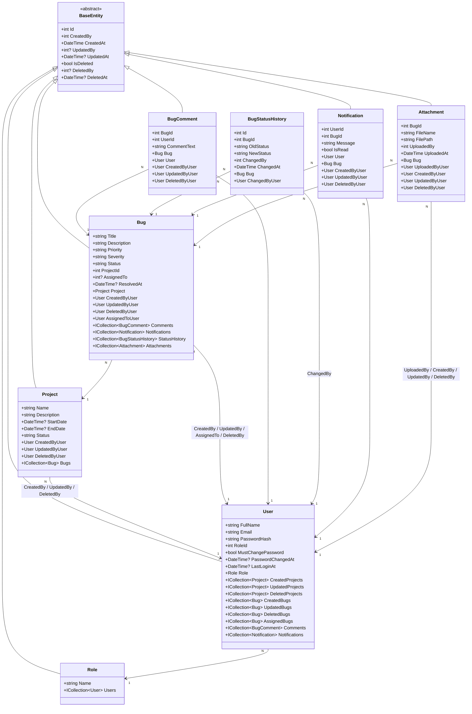
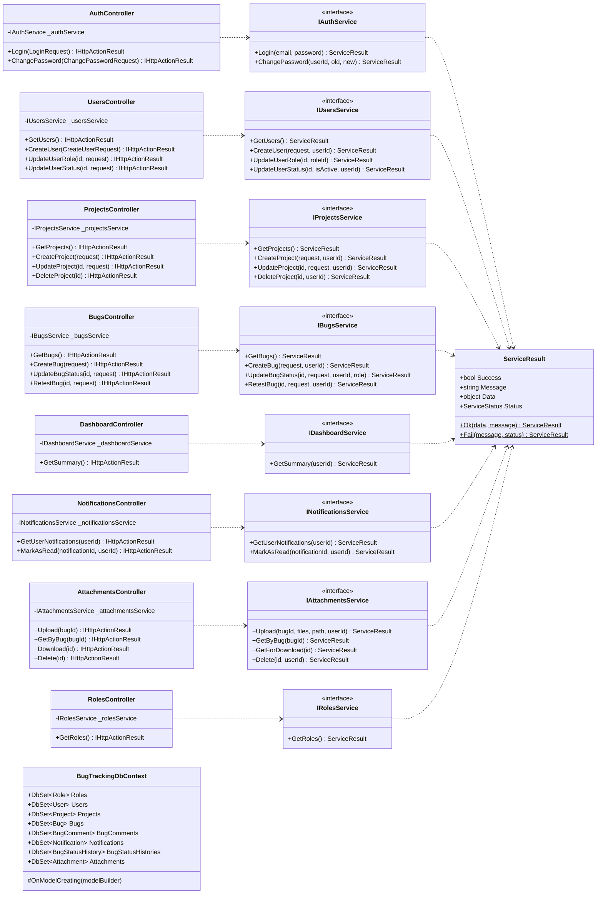

# Class Diagram — BugTrackingSystem

## Models Layer

```mermaid
classDiagram
    direction TB

    class BaseEntity {
        <<abstract>>
        +int Id
        +int CreatedBy
        +DateTime CreatedAt
        +int? UpdatedBy
        +DateTime? UpdatedAt
        +bool IsDeleted
        +int? DeletedBy
        +DateTime? DeletedAt
    }

    class Role {
        +string Name
        +ICollection~User~ Users
    }

    class User {
        +string FullName
        +string Email
        +string PasswordHash
        +int RoleId
        +bool MustChangePassword
        +DateTime? PasswordChangedAt
        +DateTime? LastLoginAt
        +Role Role
        +ICollection~Project~ CreatedProjects
        +ICollection~Project~ UpdatedProjects
        +ICollection~Project~ DeletedProjects
        +ICollection~Bug~ CreatedBugs
        +ICollection~Bug~ UpdatedBugs
        +ICollection~Bug~ DeletedBugs
        +ICollection~Bug~ AssignedBugs
        +ICollection~BugComment~ Comments
        +ICollection~Notification~ Notifications
    }

    class Project {
        +string Name
        +string Description
        +DateTime? StartDate
        +DateTime? EndDate
        +string Status
        +User CreatedByUser
        +User UpdatedByUser
        +User DeletedByUser
        +ICollection~Bug~ Bugs
    }

    class Bug {
        +string Title
        +string Description
        +string Priority
        +string Severity
        +string Status
        +int ProjectId
        +int? AssignedTo
        +DateTime? ResolvedAt
        +Project Project
        +User CreatedByUser
        +User UpdatedByUser
        +User DeletedByUser
        +User AssignedToUser
        +ICollection~BugComment~ Comments
        +ICollection~Notification~ Notifications
        +ICollection~BugStatusHistory~ StatusHistory
        +ICollection~Attachment~ Attachments
    }

    class BugComment {
        +int BugId
        +int UserId
        +string CommentText
        +Bug Bug
        +User User
        +User CreatedByUser
        +User UpdatedByUser
        +User DeletedByUser
    }

    class BugStatusHistory {
        +int Id
        +int BugId
        +string OldStatus
        +string NewStatus
        +int ChangedBy
        +DateTime ChangedAt
        +Bug Bug
        +User ChangedByUser
    }

    class Notification {
        +int UserId
        +int BugId
        +string Message
        +bool IsRead
        +User User
        +Bug Bug
        +User CreatedByUser
        +User UpdatedByUser
        +User DeletedByUser
    }

    class Attachment {
        +int BugId
        +string FileName
        +string FilePath
        +int UploadedBy
        +DateTime UploadedAt
        +Bug Bug
        +User UploadedByUser
        +User CreatedByUser
        +User UpdatedByUser
        +User DeletedByUser
    }

    %% Inheritance
    BaseEntity <|-- User
    BaseEntity <|-- Role
    BaseEntity <|-- Project
    BaseEntity <|-- Bug
    BaseEntity <|-- BugComment
    BaseEntity <|-- Notification
    BaseEntity <|-- Attachment

    %% Relationships
    User "N" --> "1" Role
    Project "N" --> "1" User : CreatedBy / UpdatedBy / DeletedBy
    Bug "N" --> "1" Project
    Bug "N" --> "1" User : CreatedBy / UpdatedBy / AssignedTo / DeletedBy
    BugComment "N" --> "1" Bug
    BugComment "N" --> "1" User
    BugStatusHistory "N" --> "1" Bug
    BugStatusHistory "N" --> "1" User : ChangedBy
    Notification "N" --> "1" User
    Notification "N" --> "1" Bug
    Attachment "N" --> "1" Bug
    Attachment "N" --> "1" User : UploadedBy / CreatedBy / UpdatedBy / DeletedBy
```

---

## Architecture Layer

```mermaid
classDiagram
    direction LR

    class AuthController {
        -IAuthService _authService
        +Login(LoginRequest) IHttpActionResult
        +ChangePassword(ChangePasswordRequest) IHttpActionResult
    }

    class UsersController {
        -IUsersService _usersService
        +GetUsers() IHttpActionResult
        +CreateUser(CreateUserRequest) IHttpActionResult
        +UpdateUserRole(id, request) IHttpActionResult
        +UpdateUserStatus(id, request) IHttpActionResult
    }

    class ProjectsController {
        -IProjectsService _projectsService
        +GetProjects() IHttpActionResult
        +CreateProject(request) IHttpActionResult
        +UpdateProject(id, request) IHttpActionResult
        +DeleteProject(id) IHttpActionResult
    }

    class BugsController {
        -IBugsService _bugsService
        +GetBugs() IHttpActionResult
        +CreateBug(request) IHttpActionResult
        +UpdateBugStatus(id, request) IHttpActionResult
        +RetestBug(id, request) IHttpActionResult
    }

    class DashboardController {
        -IDashboardService _dashboardService
        +GetSummary() IHttpActionResult
    }

    class NotificationsController {
        -INotificationsService _notificationsService
        +GetUserNotifications(userId) IHttpActionResult
        +MarkAsRead(notificationId, userId) IHttpActionResult
    }

    class AttachmentsController {
        -IAttachmentsService _attachmentsService
        +Upload(bugId) IHttpActionResult
        +GetByBug(bugId) IHttpActionResult
        +Download(id) IHttpActionResult
        +Delete(id) IHttpActionResult
    }

    class RolesController {
        -IRolesService _rolesService
        +GetRoles() IHttpActionResult
    }

    class IAuthService {
        <<interface>>
        +Login(email, password) ServiceResult
        +ChangePassword(userId, old, new) ServiceResult
    }

    class IUsersService {
        <<interface>>
        +GetUsers() ServiceResult
        +CreateUser(request, userId) ServiceResult
        +UpdateUserRole(id, roleId) ServiceResult
        +UpdateUserStatus(id, isActive, userId) ServiceResult
    }

    class IProjectsService {
        <<interface>>
        +GetProjects() ServiceResult
        +CreateProject(request, userId) ServiceResult
        +UpdateProject(id, request, userId) ServiceResult
        +DeleteProject(id, userId) ServiceResult
    }

    class IBugsService {
        <<interface>>
        +GetBugs() ServiceResult
        +CreateBug(request, userId) ServiceResult
        +UpdateBugStatus(id, request, userId, role) ServiceResult
        +RetestBug(id, request, userId) ServiceResult
    }

    class IDashboardService {
        <<interface>>
        +GetSummary(userId) ServiceResult
    }

    class INotificationsService {
        <<interface>>
        +GetUserNotifications(userId) ServiceResult
        +MarkAsRead(notificationId, userId) ServiceResult
    }

    class IAttachmentsService {
        <<interface>>
        +Upload(bugId, files, path, userId) ServiceResult
        +GetByBug(bugId) ServiceResult
        +GetForDownload(id) ServiceResult
        +Delete(id, userId) ServiceResult
    }

    class IRolesService {
        <<interface>>
        +GetRoles() ServiceResult
    }

    class ServiceResult {
        +bool Success
        +string Message
        +object Data
        +ServiceStatus Status
        +Ok(data, message)$ ServiceResult
        +Fail(message, status)$ ServiceResult
    }

    class BugTrackingDbContext {
        +DbSet~Role~ Roles
        +DbSet~User~ Users
        +DbSet~Project~ Projects
        +DbSet~Bug~ Bugs
        +DbSet~BugComment~ BugComments
        +DbSet~Notification~ Notifications
        +DbSet~BugStatusHistory~ BugStatusHistories
        +DbSet~Attachment~ Attachments
        #OnModelCreating(modelBuilder)
    }

    %% Controller → Interface
    AuthController ..> IAuthService
    UsersController ..> IUsersService
    ProjectsController ..> IProjectsService
    BugsController ..> IBugsService
    DashboardController ..> IDashboardService
    NotificationsController ..> INotificationsService
    AttachmentsController ..> IAttachmentsService
    RolesController ..> IRolesService

    %% Interface → ServiceResult
    IAuthService ..> ServiceResult
    IUsersService ..> ServiceResult
    IProjectsService ..> ServiceResult
    IBugsService ..> ServiceResult
    IDashboardService ..> ServiceResult
    INotificationsService ..> ServiceResult
    IAttachmentsService ..> ServiceResult
    IRolesService ..> ServiceResult
```
