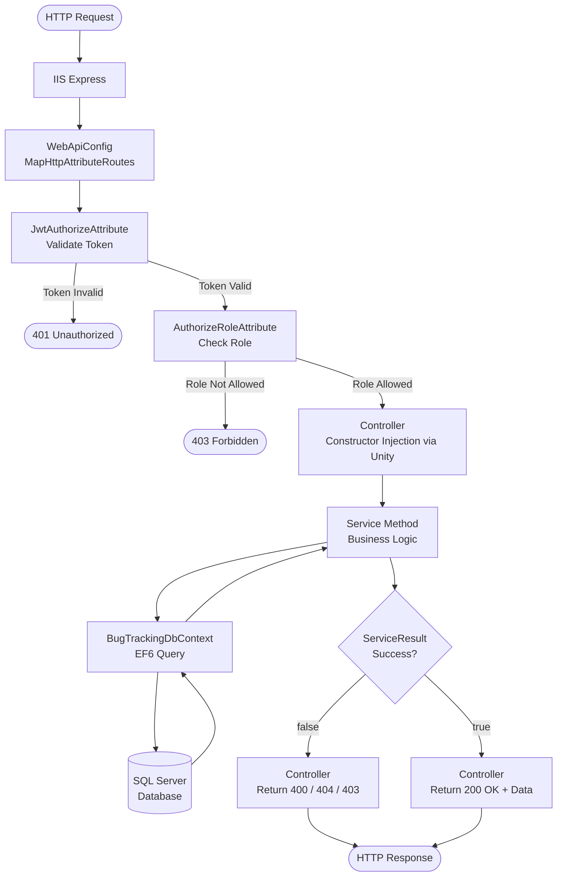
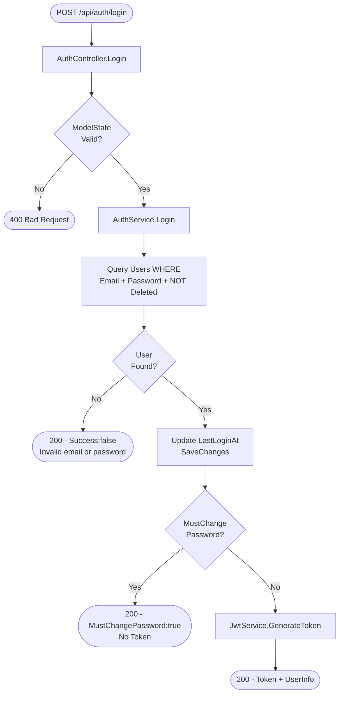
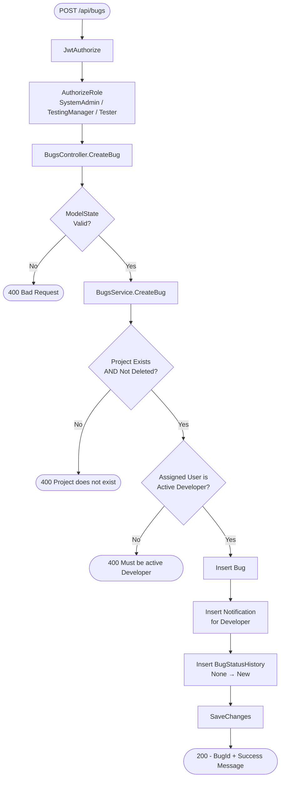
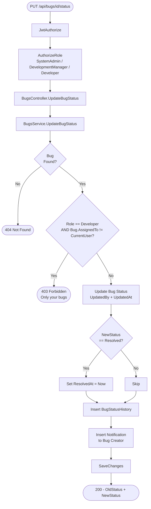
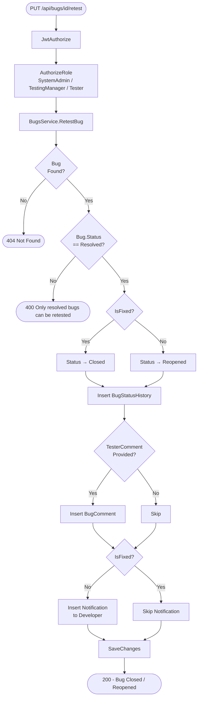
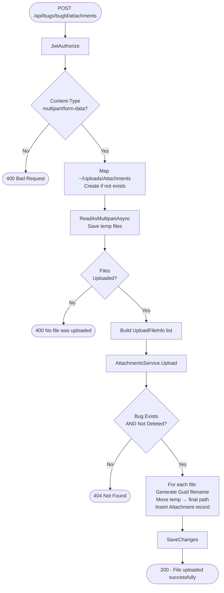
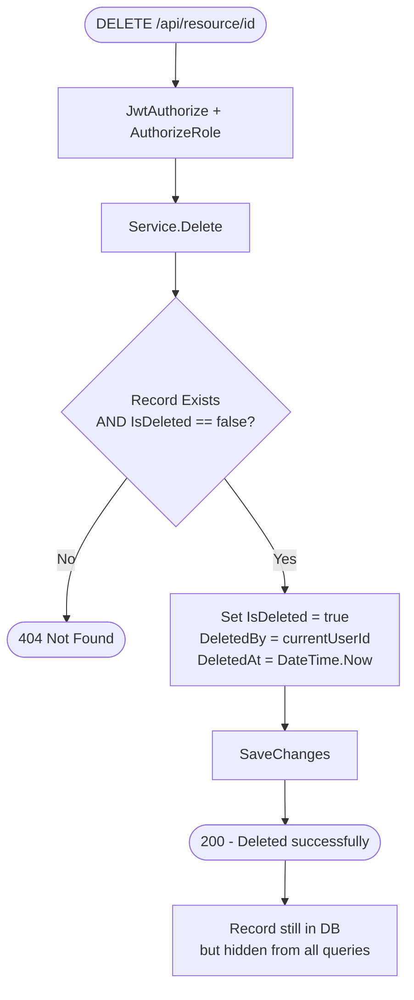
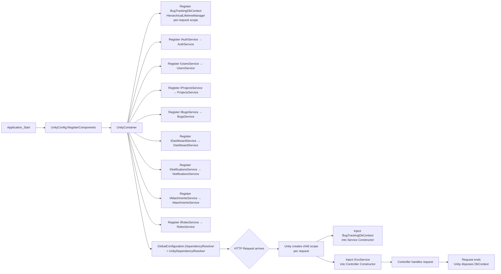

# Flowcharts — BugTrackingSystem

---

## 1. Request Lifecycle (DI Flow)

---

## 2. Login Flow

---

## 3. Create Bug Flow

---

## 4. Update Bug Status Flow

---

## 5. Retest Bug Flow

---

## 6. Upload Attachment Flow

---

## 7. Soft Delete Flow (Project / Bug / Attachment / User)

---

## 8. Unity DI — Dependency Injection Flow

